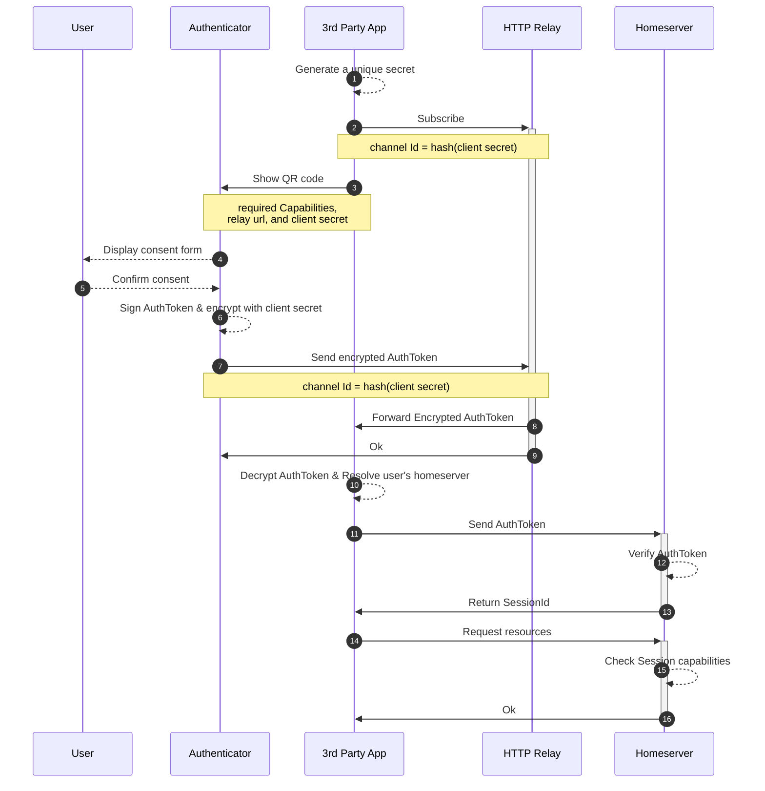

# Pubky Request Auth

Pubky Request Auth is a protocol for using user's keypair to authenticate themselves to a 3rd party app and to authorize that app to access resources on the user's homeserver.

### Glossary
1. **Authenticator**: An application holding the Keypair used in authentication. Eg [Pubky Ring](https://github.com/pubky/pubky-ring).
1. **Pubky**: The public key (pubky) identifying the user.
1. **Homeserver**: The public key (pubky) identifying the receiver of the authentication request, usually a server.
1. **3rd Party App**: An application trying to get authorized to access some resources belonging to the **Pubky**.
1. **Capabilities**: A list of strings specifying scopes and the actions that can be performed on them.
1. **HTTP relay**: An independent HTTP relay (or the backend of the 3rd Party App) forwarding the [`AuthToken`](#authtoken-encoding) to the frontend.  

## Flow

Here's how is works:



1. `3rd Party App` generates a unique (32 bytes) `client_secret`.
1. `3rd Party App` uses the `base64url(hash(client_secret))` as a `channel_id` and subscribe to that channel on the `HTTP Relay` it is using.
1. `3rd Party App` formats a Pubky Auth url:
```
pubkyauth:///
   ?relay=<HTTP Relay base (without channel_id)>
   &caps=<required capabilities>
   &secret=<base64url(client_secret)>
```
 for example 
 ```
pubkyauth:///
  ?relay=https://httprelay.pubky.app/inbox
  &caps=/pub/pubky.app/:rw,/pub/example.com/nested:rw
  &secret=mAa8kGmlrynGzQLteDVW6-WeUGnfvHTpEmbNerbWfPI
 ```
 and finally show that URL as a QR code to the user.

The request may also carry x-callback-url metadata used by an authenticator to
return control to the requesting application:

| Parameter | Meaning |
| --- | --- |
| `x-source` | Human-readable name of the requesting application. |
| `x-success` | Destination after successful handling. |
| `x-error` | Destination after an error. |
| `x-cancel` | Destination after cancellation or timeout. |

Values are percent-encoded once as URI components. Authenticators should
decode them exactly once; in particular, nested percent escapes must remain
escaped for the destination URL. For compatibility, `callback` may be parsed
as a fallback for `x-success`, but new requests should emit `x-success`.

1. The `Authenticator` app scans that QR code, parses the URL and shows a consent form for the user.
1. The user decides whether or not to grant these capabilities to the `3rd Party App`.
1. If the user approves, the `Authenticator` uses their Keypair to sign an [`AuthToken`](#authtoken-encoding), then encrypts that token with the `client_secret`. The `channel_id` is then calculated by hashing that secret and the encrypted token is sent to the callback url, which is the `relay` + `channel_id`.
1. `HTTP Relay` forwards the encrypted `AuthToken` to the `3rd Party App` frontend and confirms the delivery with the `Authenticator`.
1. `3rd Party App` decrypts the AuthToken using its `client_secret`, reads the `pubky` in it and sends it to their `Homeserver` to obtain a session.
1. `Homeserver` verifies the session and stores the corresponding `capabilities`.
1. `Homeserver` returns a session Id to the frontend to use in subsequent requests.
1. `3rd Party App` uses the session Id to access some resource at the Homeserver.
1. `Homeserver` checks the session capabilities to see if it is allowed to access that resource.
1. `Homeserver` responds to the `3rd Party App` with the resource.

### AuthToken encoding
```abnf
AuthToken   = signature namespace version timestamp pubky capabilities

signature      = 64OCTET ; ed25519 signature over the rest of the token
namespace      = %x50.55.42.4b.59.3a.41.55.54.48 ; "PUBKY:AUTH" in UTF-8 (10 bytes)
version        = OCTET ; Version of the AuthToken for future proofing
timestamp      = 8OCTET ; Big-endian UNIX timestamp in microseconds
pubky          = 32OCTET ; ed25519 public key of the user
capabilities   = *(capability *( "," capability ))

capability     = scope ":" actions ; Formatted as `/path/to/resource:rw`

scope          = absolute-path ; Absolute path, see RFC 3986
absolute-path  = 1*( "/" segment )
segment        = <segment, see [URI], Section 3.3>

actions        = 1*action
action         = "r" / "w" ; Read or write (more actions can be specified later)
```

### AuthToken verification
To verify a token the `Homeserver` should:
1. Check the 75th byte (version) and make sure it is `0` for this spec.
1. Deserialize the token
1. Verify that the `timestamp` is within a window from the local time: the default should be 3 minutes in the past and 3 minutes in the future to handle latency and drifts.
1. Verify that the `pubky` is the signer of the `signature` over the rest of the serialized token after the signature (`serialized_token[65..]`).
1. To avoid reuse of the token the `Homeserver` should consider the `timestamp` and `pubky`  (`serialized_token[75..115]`) as a unique sortable ID, and store it in a sortable key value store, rejecting any token that has the same ID, and removing all IDs that start with a timestamp that is older than the window mentioned in step 3.

## Unhosted Apps and Relays
Callback URLs work fine for full-stack applications. There are however many cases where you would want to develop an application without a backend, yet you still would like to let users sign in and bring their own backend. The idea of [Unhosted](https://unhosted.org/) applications is one of the main reasons we are developing Homeservers.

These applications will still need some [relay](https://httprelay.io/) to receive the `AuthToken` when the `Authenticator` sends it to the callback URL. Since the `AuthToken` is a bearer token these relays can intercept it and use it before the unhosted app. That is why we need to encrypt the `AuthToken` with a key that the relay doesn't have access to, and only shared between the app and the `Authenticator` 

## Limitations

### No delegation
In version zero the `pubky` **is** the `issuer`, meaning that the `AuthToken` is signed by the same key of the `pubky`. This is to simplify the spec until we have a reason to keep the `issuer` keys even more secure than being in a mobile app used rarely to authenticate a browser session once in a while.

Having an `issuer` that isn't exactly the `pubky` means the `issuer` themselves need a certificate of delegation signed by the `pubky`. The problem with that is that you can either lookup that certificate on the Homeserver (making the verification process async and possibly taking too long to timeout) or do what most TLS apps do right now and send the certificates chain with the token. The problem with this is that you then have to deal with the eternal problem of revocation, which basically also forces you to go lookup somewhere making the the verification process async and possibly taking too long before timeout.

### Expiration is out of scope
While the token itself can only be used for very brief period, it is immediately exchanged for another authentication mechanism (usually a session ID). Deciding the expiration date of that authentication, if any, is out of the scope of this spec.

The assumption here is that we are authorizing a session to the `Homeserver` such that the user can always access all active sessions and revoke any session that they don't like, all from the `Authenticator` app.

Other services are free to choose their authentication system once the homeserver verifies the pubky auth token, whether that is an opaque bearer or a session with or without expiration, and are free to allow the user to manage sessions the way they see fit.
